# TierYourLife

> A ranking journal for Android. Put anything you care about on an **S / A / B / C / D**
> board — films, games, restaurants, albums, people's cooking — and keep it. Not a one-off
> tier-list generator: your boards live on the device and stay editable. Private by default,
> and any one of them can be published for other people to rank for themselves.

[](https://github.com/kellygracelab-dotcom/TierYourLife/actions/workflows/ci.yml)


🚧 **Work in progress** — built from scratch, in the open, as a learning flagship. The commit history *is* the story.

📱 **[Install the demo APK](https://github.com/kellygracelab-dotcom/TierYourLife/releases/latest)** — everything works except the two parts that need private keys: image generation falls back to a local stub, and catalogue search uses Wikidata only.

---

<p align="center">
  
</p>

<p align="center">
  <sub>Drag an item into a tier, then drag the tier itself — neighbours move out of the way while your finger is still down.</sub>
</p>

## The app

| Your boards | A board | Settings |
|:---:|:---:|:---:|
|  | 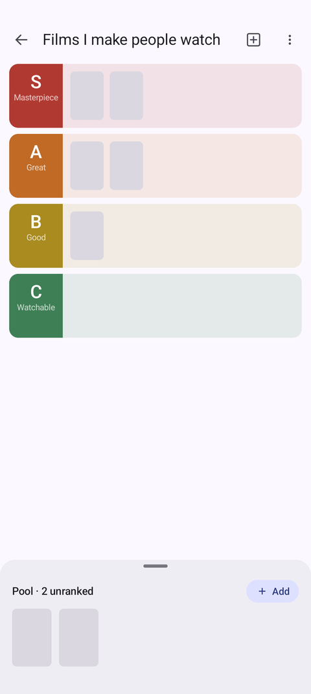 | 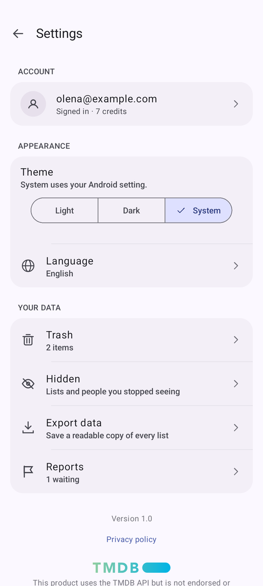 |

Light and dark are designed separately — each tier carries two colours, so a band that is readable
on white is not a glowing slab at night. The theme follows the system or is pinned in settings.

| A board, dark | Nothing yet | Settings, dark |
|:---:|:---:|:---:|
| 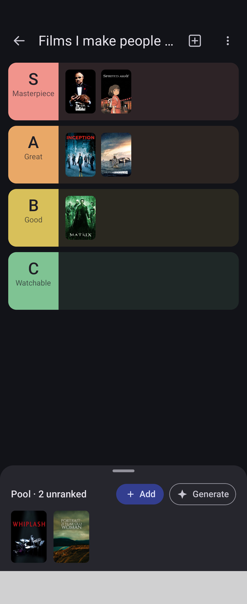 | 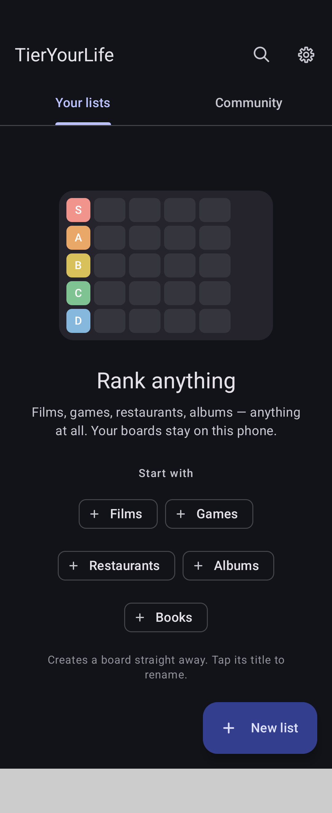 | 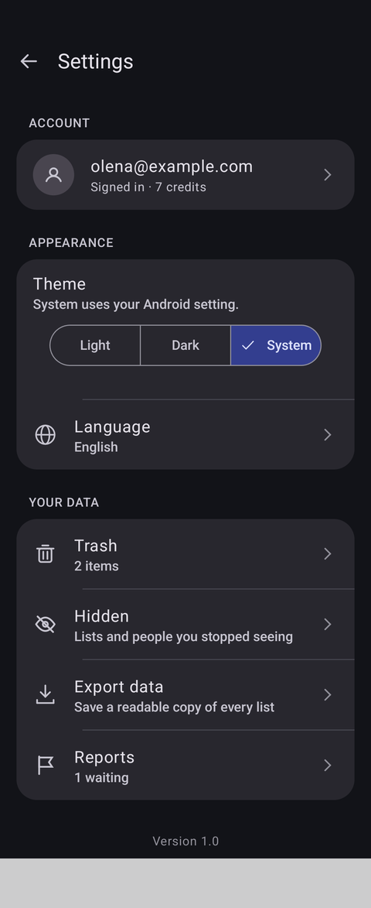 |

## The community

A board you publish becomes something other people can open and rank themselves. They get your
cards and your tiers, and an empty board to fill: the ranking is the part you do not hand over.

| The feed | Long-press a card | Reporting one |
|:---:|:---:|:---:|
| 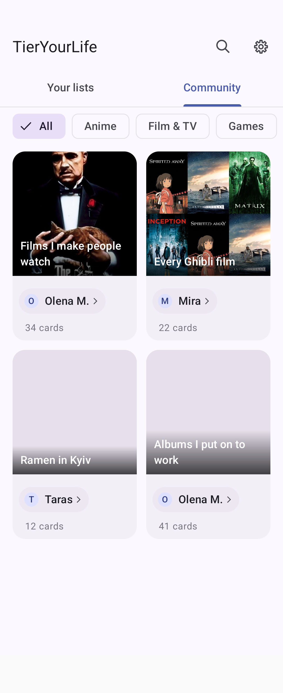 | 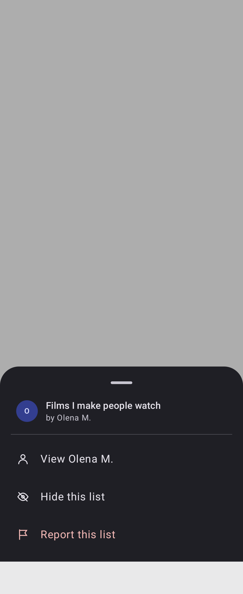 | 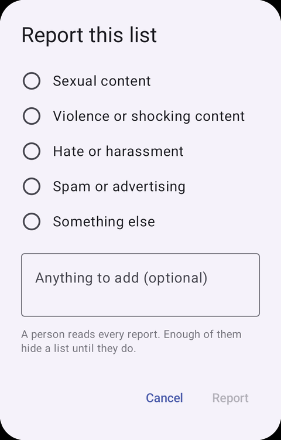 |

A card shows a cover if the author set one, otherwise a mosaic of the list's own artwork,
otherwise the author's tier palette — three kinds of card in one grid, each saying as much
about the list as it can.

Nothing is moderated automatically. Reports go to one person who reads them by hand, and the
app says so before the button is pressed rather than implying a moderation team. Hiding sits
next to reporting because most of the time "I would rather not see this" is not an accusation,
and both can be undone from Settings.

| Hidden, and put back | The report queue | What you have published |
|:---:|:---:|:---:|
| 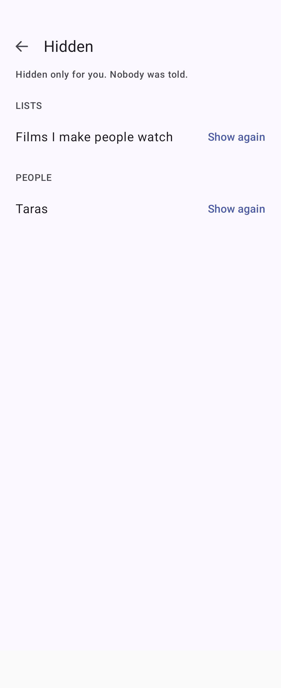 | 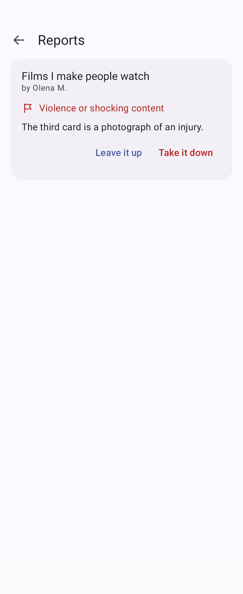 | 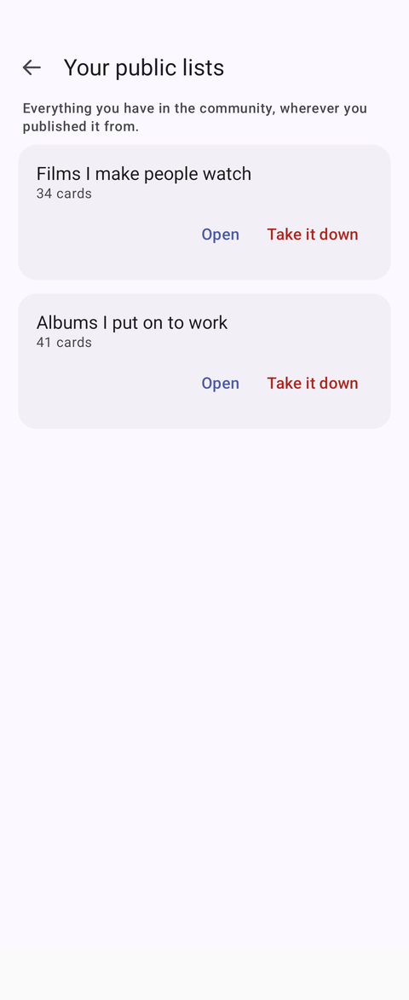 |

Opening someone else's board gives you their cards and their tiers and an empty board, and the
author is a person you can open rather than a line of text.

| Someone else's board | Their profile |
|:---:|:---:|
| 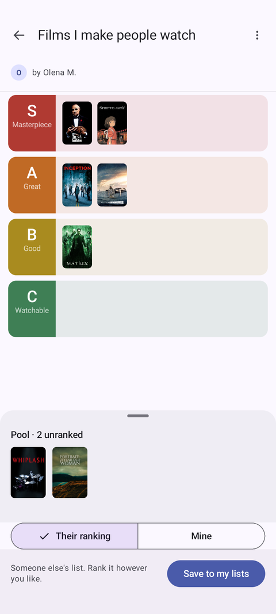 | 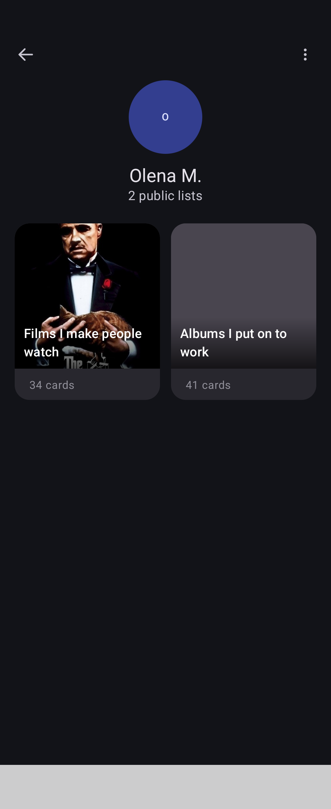 |

## On a tablet, and on a folded phone

Filling a tablet's width is not the same as using it. Content has a measure and the window keeps
the rest: 640dp for rows where a label and its control have to stay in one glance, 1080dp for a
board — wider on purpose, because a tier is a horizontal strip and width is the one thing it can
spend. The feed is the exception: there the width buys more cards rather than bigger ones.

Past 600dp the navigation moves to a rail on the left and the tabs, the settings icon and the
corner button all move into it — they were the same job, and two navigation systems on one screen
is what makes tablet layouts fall apart. Sheets become centred dialogs at the same point: a bottom
sheet is a phone shape, and on a tablet it is a strip along the bottom edge of a mostly empty
window. Past 840dp the list of boards stands beside the board rather than a screen away.

The window is classified by what a layout may do rather than by device — a phone in split view is
not a tablet, and a folding phone is three different windows within a second. A folding phone's
cover screen is its own case: it shows a board and refuses everything else, because ranking is a
drag and a drag across 46dp rows with a camera cutout in the corner is a worse version of a gesture
that works perfectly one fold away.

| A board at 1280×800dp | The feed | Settings |
|:---:|:---:|:---:|
| 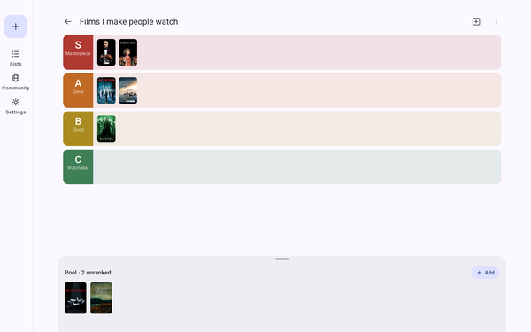 | 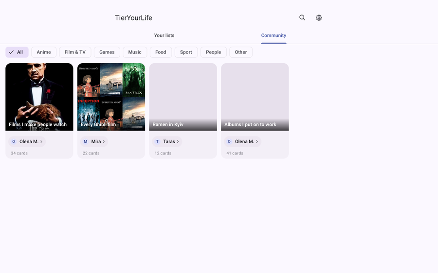 | 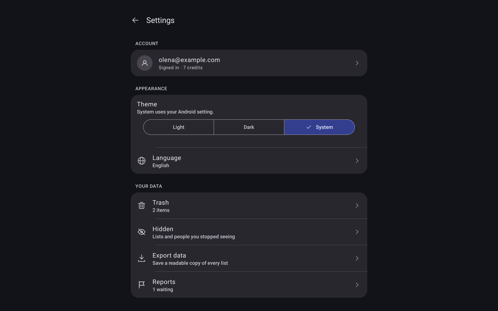 |

Upright is asked for only while the window is compact, so a phone stays a phone — including a
folding one, which is two different answers in one body — and a tablet turns freely.

## What it does today

- **Boards.** Create lists, rename them, reorder tiers, edit each tier's label, caption and
  colour — light and dark shades set separately, by HSL sliders or hex.
- **Drag and drop.** Move an item between tiers or within one; the insertion point follows the
  pointer in reading order, right-to-left included. Dragging a tier row reorders the board live:
  the row itself travels with your finger and its neighbours shift as it passes them.
- **Add items four ways.** Search a catalogue, type a name by hand, pick photos from the
  gallery, or generate an image with AI. Images are downscaled on the way in, so a board of 200
  items stays well inside Android's 25 MB auto-backup quota.
- **Catalogue search.** One field, two sources behind it — TMDB and Wikidata — merged,
  deduplicated and ranked into a single list. If one source is down the other still answers.
- **Trash, not deletion.** Deleted lists and items go to a trash screen with the time they were
  removed and a one-tap restore. Deleting a tier does not take its trashed items with it.
- **Publish a board.** Make one public and it joins the community feed under a category, with a
  cover you choose. Deleting your list takes it down; a copy someone already saved stays theirs.
- **The community.** Browse by category, search across it, open anyone's profile and see
  everything they have published, and save a copy of any board into your own library.
- **Report or hide.** Long-press a card, or use the overflow inside a list or on a profile.
  Reporting hides it for you at once and files a complaint for a person to read; hiding does the
  first half without the accusation. Both are listed in Settings and can be undone.
- **Export.** Any list to a text file, then share it through the system sheet.
- **Eleven languages** — English, Ukrainian, Russian, Spanish, Portuguese (BR), German, French,
  Polish, Turkish, Japanese, Arabic — switchable inside the app without a restart or a flash of
  the old language. Arabic is fully right-to-left: layout, icon mirroring and drag arithmetic.
- **Light, dark, or follow the system**, applied before the first frame is drawn.

Your boards are local and private until you say otherwise. Publishing one is the only thing that
sends a board anywhere, and it sends a snapshot: the cards and the tier definitions, never the
ranking. Everything else stays on the phone, including photos from your gallery and generated
artwork — a published list shows its web-hosted pictures and nothing else.

Signing in is only needed to publish, and it is Google or nothing: no password to store, no
email shown to anyone. Reading the community, saving a copy and reporting all work without an
account. Everything metered — image generation, publishing — runs through a proxy that never
sees a list it was not given, and the app's own keys never ship inside it.

## AI image studio

Some things you want to rank have no poster anywhere — a house rule, a running joke, an idea.
The studio generates the missing artwork: describe an image, keep the ones you like as cards.

| Describe | Result | Name it |
|:---:|:---:|:---:|
|  |  |  |

The card lands at the front of the pool with a single undo covering everything added that session:

<p align="center">
  
</p>

The generator sits behind a port in the domain layer (`CardImageGenerator`), so the app has two
interchangeable implementations: **Gemini** when a proxy is configured, and a **local stub** that
draws placeholder art when it is not. Nothing above the data layer knows which one is running — the
screen, the view model and every test are identical either way.

Generation through the proxy is metered: the studio shows what is left, and running out is its own
state rather than an error, because "no generations left" and "that didn't work" are answered
differently. The stub counts nothing and shows no number — its images never leave the phone.

## Architecture

```
app                          ← Application, Activity, theme + locale bootstrap
navigation                   ← the NavHost that composes features into one graph
core:settings                ← theme, language, and what this phone has hidden
core:theme                   ← Material 3 colour scheme and typography
core:logging                 ← Timber, and the only module that knows a crash reporter exists
core:network                 ← App Check and ID-token interceptors shared by every caller
core:ui                      ← the pieces more than one feature draws
feature:tier:domain          ← models, repository ports, pure search-merge logic (no Android)
feature:tier:data            ← Room, Retrofit, image store, Hilt wiring
feature:tier:presentation    ← Compose screens, view models, strings
feature:account:domain       ← who is signed in, as three states rather than a nullable user
feature:account:data         ← Firebase Auth, Google linking, the author's name and face
feature:account:presentation ← the account screen and its sheets
feature:aistudio:domain      ← generation and library ports, generated-image model
feature:aistudio:data        ← Gemini client, stub generator, credits, image store
feature:aistudio:presentation ← the studio screen and its components
build-logic                  ← convention plugins: library, compose, hilt, room, network, navigation
```

Dependencies point inward: `presentation` and `data` both depend on `domain`, and never on each
other. Features never reference another feature's screens — each owns its routes and offers
`NavGraphBuilder` extensions, and `navigation` wires them together, so `app` is left with
bootstrap only. Each module's Gradle file is a handful of lines because the repeated setup lives
in `build-logic` as typed convention plugins rather than in copied blocks.

Two documents in [`docs/`](docs) carry the reasoning rather than the result: the
[presentation-layer rules](docs/architecture-presentation.md) every screen follows, and the
[AI studio design spec](docs/design-spec-ai-image-studio.md), including the decisions that were
reversed after using the feature on a real phone.

## Tech stack

- **Language:** Kotlin · Coroutines · Flow
- **UI:** Jetpack Compose · Material 3 · Navigation Compose (type-safe routes)
- **Architecture:** clean architecture · multi-module · ports and adapters · unidirectional data flow
- **DI:** Hilt
- **Data:** Room (entities, views, transactions, migrations, exported schemas) · SharedPreferences
- **Network:** Retrofit · OkHttp · kotlinx.serialization · TMDB · Wikidata SPARQL · Gemini
- **Backend:** Firebase — Auth, App Check (Play Integrity), Crashlytics, and Cloud Functions in
  front of Firestore, in a [separate repository](https://github.com/kellygracelab-dotcom/tieryourlife-proxy)
- **Logging:** Timber, with one tree for logcat in debug and one that turns warnings carrying an
  exception into non-fatal Crashlytics reports
- **Images:** Coil 3
- **Build:** Gradle Kotlin DSL · version catalog · convention plugins · KSP
- **Tests:** JUnit4 · Compose UI tests · Room in-memory tests · hand-written fakes
- **CI:** GitHub Actions — build, unit tests and lint, plus the full instrumentation suite on
  emulators at API 24 and 34

## Tests

Every push runs the whole suite:

| Where | What they cover |
|---|---|
| JVM | domain logic, search merging, title derivation, DTO parsing, repository behaviour against fakes, the sync plan, the board fingerprint, which window gets which layout |
| Instrumented — data | Room DAOs, transactions, cascades, migrations, the image store, pictures going up and coming back |
| Instrumented — presentation | Compose screens, view models, drag arithmetic, RTL layout |
| Instrumented — app | manifest contract (RTL support, orientation by window size, config-change handling) |
| Instrumented — every language | every screen rendered in all eleven, and written out to look at |
| Instrumented — the README | the pictures above, drawn rather than photographed ([how](docs/screenshots.md)) |

Some of these exist because a bug got through first: a locale change that quietly broke three
things visible in no other language, a tier deletion that took recoverable items with it, a
floating drag preview that ran away from the finger in Arabic, and a collapsed pool bar whose
centre tap opened the wrong sheet once a second chip joined it. Two more joined them while sync
was being built — a fingerprint that hashed a file path, so two phones would never have agreed
they held the same board, and a timestamp trigger that fired on the stamp it had just written.

## How this was built

AI agents were part of the workflow here, and the commit history reflects that.

The division of labour: specifications, architectural decisions, code review and on-device
testing are mine; a large share of the code was written by agents against those
specifications. The reasoning behind the decisions lives in [`docs/`](docs) — the
presentation-layer rules every screen follows, the AI studio design spec, and the choices
that were reversed after using the feature on a real phone.

The screens were designed before they were built, in a separate design workspace —
[the canvas is here](https://claude.ai/code/artifact/1a2cee57-91d4-46bd-99fd-ebd54d18b42c)
if you want the drawings rather than the prose.

Stating it plainly because it is visible in the history either way, and because how a
codebase was produced is a reasonable thing to want to know.

## Building

```bash
git clone https://github.com/kellygracelab-dotcom/TierYourLife.git
```

Open in Android Studio and run the `app` configuration. minSdk 24, targetSdk 37, JDK 21.

Catalogue search works out of the box through Wikidata. The TMDB source runs through the same
proxy as image generation, so the app carries no token for it either — configure the proxy URL
below and both sources answer.

The AI image studio works out of the box too, on a built-in stub that draws placeholder art
locally — no key, no network call. To generate real images, point the app at a deployment of the
[proxy backend](https://github.com/kellygracelab-dotcom/tieryourlife-proxy) in `local.properties`:

```properties
PROXY_BASE_URL=https://europe-west1-your-project.cloudfunctions.net/
```

The app itself holds no Gemini key. It sends the prompt to the proxy, which attaches the key on the
server and returns the finished JPEG — so nothing extractable ships in the APK, and the phone never
decodes base64.

Requests carry two tokens. A Firebase App Check token proves the caller is the released app; an
anonymous Firebase ID token says which install, which is what the proxy counts the generation
against. App Check alone cannot meter anything — it is satisfied by every copy of the app equally,
so with it as the only gate one person could spend without limit.

## What's next

- [ ] **Boards that follow you.** Everything is on one phone today, so a new phone starts empty.
      The row ids that make syncing possible are already in the schema; the sync itself is not.
- [ ] Native-speaker review of the Arabic, Japanese and Turkish translations
- [ ] Ranking history: what moved between tiers and when
- [ ] Share a board as an image

---

<sub>Built with Kotlin & Jetpack Compose · learning flagship, summer 2026</sub>
