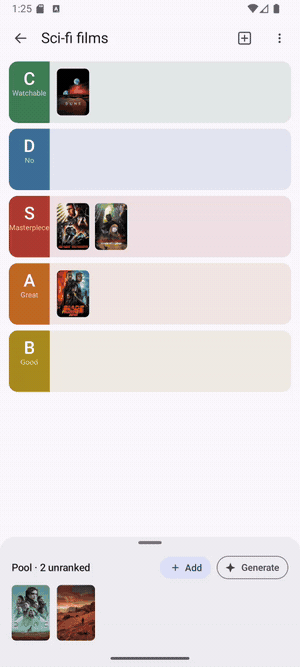
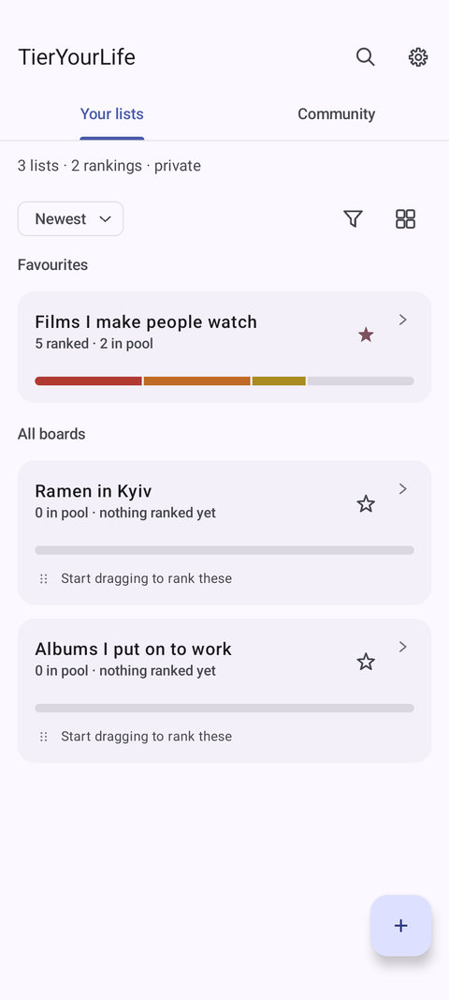
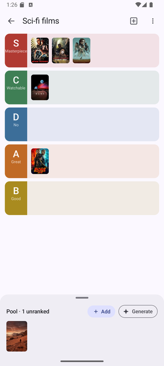
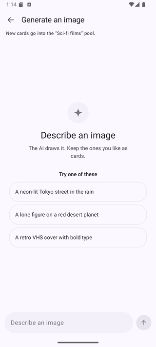
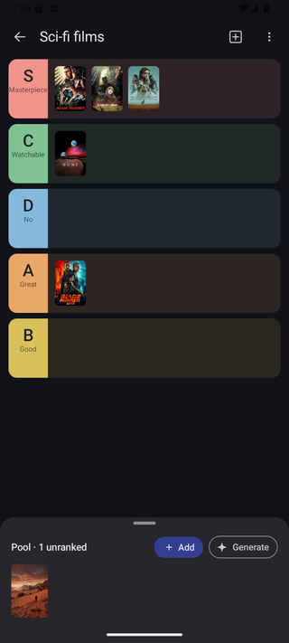
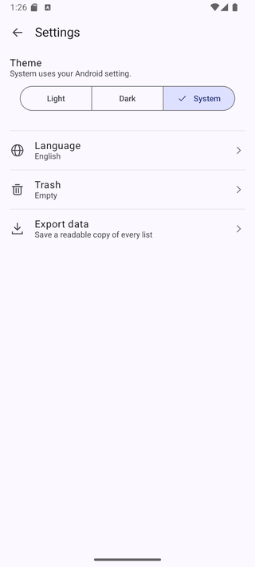
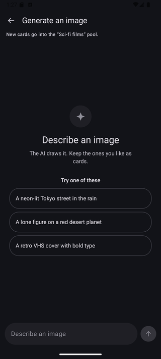
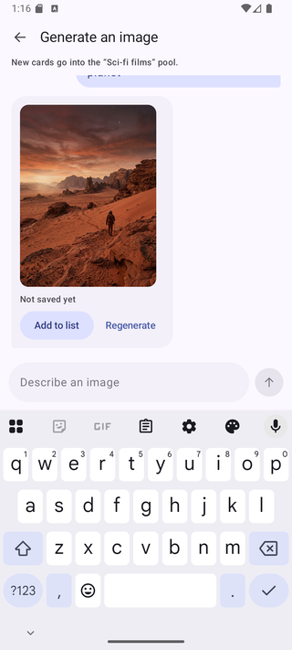
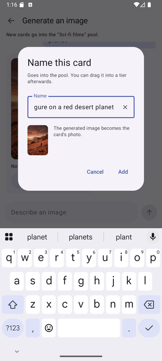
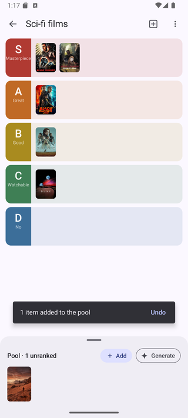

# TierYourLife

> A private ranking journal for Android. Put anything you care about on an **S / A / B / C / D**
> board — films, games, restaurants, albums, people's cooking — and keep it. Not a one-off
> tier-list generator: your boards live on the device, stay editable, and are yours alone.

[](https://github.com/kellygracelab-dotcom/TierYourLife/actions/workflows/ci.yml)


🚧 **Work in progress** — built from scratch, in the open, as a learning flagship. The commit history *is* the story.

📱 **[Install the demo APK](https://github.com/kellygracelab-dotcom/TierYourLife/releases/latest)** — everything works except the two parts that need private keys: image generation falls back to a local stub, and catalogue search uses Wikidata only.

---

<p align="center">
  
</p>

<p align="center">
  <sub>Drag an item into a tier, then drag the tier itself — neighbours move out of the way while your finger is still down.</sub>
</p>

## The app

| Your boards | A board | AI image studio |
|:---:|:---:|:---:|
|  |  |  |

Light and dark are designed separately — each tier carries two colours, so a band that is readable
on white is not a glowing slab at night. The theme follows the system or is pinned in settings.

| Light | Dark | Settings |
|:---:|:---:|:---:|
|  |  |  |

## What it does today

- **Boards.** Create lists, rename them, reorder tiers, edit each tier's label, caption and
  colour — light and dark shades set separately, by HSL sliders or hex.
- **Drag and drop.** Move an item between tiers or within one; the insertion point follows the
  pointer in reading order, right-to-left included. Dragging a tier row reorders the board live:
  the row itself travels with your finger and its neighbours shift as it passes them.
- **Add items four ways.** Search a catalogue, type a name by hand, pick photos from the
  gallery, or generate an image with AI. Images are downscaled on the way in, so a board of 200
  items stays well inside Android's 25 MB auto-backup quota.
- **Catalogue search.** One field, two sources behind it — TMDB and Wikidata — merged,
  deduplicated and ranked into a single list. If one source is down the other still answers.
- **Trash, not deletion.** Deleted lists and items go to a trash screen with the time they were
  removed and a one-tap restore. Deleting a tier does not take its trashed items with it.
- **Export.** Any list to a text file, then share it through the system sheet.
- **Eleven languages** — English, Ukrainian, Russian, Spanish, Portuguese (BR), German, French,
  Polish, Turkish, Japanese, Arabic — switchable inside the app without a restart or a flash of
  the old language. Arabic is fully right-to-left: layout, icon mirroring and drag arithmetic.
- **Light, dark, or follow the system**, applied before the first frame is drawn.

Your boards are local. No sign-in, no analytics, nothing about them leaves the device. The only
network calls are the two catalogue search sources, the images they point at, and image generation
— which signs in anonymously, because generating an image costs real money and the server has to
know whose allowance to count it against. No screen, no email, nothing asked of you.

## AI image studio

Some things you want to rank have no poster anywhere — a house rule, a running joke, an idea.
The studio generates the missing artwork: describe an image, keep the ones you like as cards.

| Describe | Result | Name it |
|:---:|:---:|:---:|
|  |  |  |

The card lands at the front of the pool with a single undo covering everything added that session:

<p align="center">
  
</p>

The generator sits behind a port in the domain layer (`CardImageGenerator`), so the app has two
interchangeable implementations: **Gemini** when a proxy is configured, and a **local stub** that
draws placeholder art when it is not. Nothing above the data layer knows which one is running — the
screen, the view model and every test are identical either way.

Generation through the proxy is metered: the studio shows what is left, and running out is its own
state rather than an error, because "no generations left" and "that didn't work" are answered
differently. The stub counts nothing and shows no number — its images never leave the phone.

## Architecture

```
app                          ← Application, Activity, theme + locale bootstrap
navigation                   ← the NavHost that composes features into one graph
core:settings                ← theme and language preferences
core:theme                   ← Material 3 colour scheme and typography
feature:tier:domain          ← models, repository ports, pure search-merge logic (no Android)
feature:tier:data            ← Room, Retrofit, image store, Hilt wiring
feature:tier:presentation    ← Compose screens, view models, strings
feature:aistudio:domain      ← generation and library ports, generated-image model
feature:aistudio:data        ← Gemini client, stub generator, credits, image store
feature:aistudio:presentation ← the studio screen and its components
build-logic                  ← convention plugins: library, compose, hilt, room, network, navigation
```

Dependencies point inward: `presentation` and `data` both depend on `domain`, and never on each
other. Features never reference another feature's screens — each owns its routes and offers
`NavGraphBuilder` extensions, and `navigation` wires them together, so `app` is left with
bootstrap only. Each module's Gradle file is a handful of lines because the repeated setup lives
in `build-logic` as typed convention plugins rather than in copied blocks.

Two documents in [`docs/`](docs) carry the reasoning rather than the result: the
[presentation-layer rules](docs/architecture-presentation.md) every screen follows, and the
[AI studio design spec](docs/design-spec-ai-image-studio.md), including the decisions that were
reversed after using the feature on a real phone.

## Tech stack

- **Language:** Kotlin · Coroutines · Flow
- **UI:** Jetpack Compose · Material 3 · Navigation Compose (type-safe routes)
- **Architecture:** clean architecture · multi-module · ports and adapters · unidirectional data flow
- **DI:** Hilt
- **Data:** Room (entities, views, transactions, migrations, exported schemas) · SharedPreferences
- **Network:** Retrofit · OkHttp · kotlinx.serialization · TMDB · Wikidata SPARQL · Gemini
- **Images:** Coil 3
- **Build:** Gradle Kotlin DSL · version catalog · convention plugins · KSP
- **Tests:** JUnit4 · Compose UI tests · Room in-memory tests · hand-written fakes
- **CI:** GitHub Actions — build, unit tests and lint, plus the full instrumentation suite on
  emulators at API 24 and 34

## Tests

Every push runs the whole suite:

| Where | What they cover |
|---|---|
| JVM | domain logic, search merging, title derivation, DTO parsing, repository behaviour against fakes |
| Instrumented — data | Room DAOs, transactions, cascades, the image store |
| Instrumented — presentation | Compose screens, view models, drag arithmetic, RTL layout |
| Instrumented — app | manifest contract (RTL support, config-change handling) |

Some of these exist because a bug got through first: a locale change that quietly broke three
things visible in no other language, a tier deletion that took recoverable items with it, a
floating drag preview that ran away from the finger in Arabic, and a collapsed pool bar whose
centre tap opened the wrong sheet once a second chip joined it.

## How this was built

AI agents were part of the workflow here, and the commit history reflects that.

The division of labour: specifications, architectural decisions, code review and on-device
testing are mine; a large share of the code was written by agents against those
specifications. The reasoning behind the decisions lives in [`docs/`](docs) — the
presentation-layer rules every screen follows, the AI studio design spec, and the choices
that were reversed after using the feature on a real phone.

The screens were designed before they were built, in a separate design workspace —
[the canvas is here](https://claude.ai/code/artifact/1a2cee57-91d4-46bd-99fd-ebd54d18b42c)
if you want the drawings rather than the prose.

Stating it plainly because it is visible in the history either way, and because how a
codebase was produced is a reasonable thing to want to know.

## Building

```bash
git clone https://github.com/kellygracelab-dotcom/TierYourLife.git
```

Open in Android Studio and run the `app` configuration. minSdk 24, targetSdk 37, JDK 21.

Catalogue search works out of the box through Wikidata. The TMDB source runs through the same
proxy as image generation, so the app carries no token for it either — configure the proxy URL
below and both sources answer.

The AI image studio works out of the box too, on a built-in stub that draws placeholder art
locally — no key, no network call. To generate real images, point the app at a deployment of the
[proxy backend](https://github.com/kellygracelab-dotcom/tieryourlife-proxy) in `local.properties`:

```properties
PROXY_BASE_URL=https://europe-west1-your-project.cloudfunctions.net/
```

The app itself holds no Gemini key. It sends the prompt to the proxy, which attaches the key on the
server and returns the finished JPEG — so nothing extractable ships in the APK, and the phone never
decodes base64.

Requests carry two tokens. A Firebase App Check token proves the caller is the released app; an
anonymous Firebase ID token says which install, which is what the proxy counts the generation
against. App Check alone cannot meter anything — it is satisfied by every copy of the app equally,
so with it as the only gate one person could spend without limit.

## What's next

- [ ] Native-speaker review of the Arabic, Japanese and Turkish translations
- [ ] Ranking history: what moved between tiers and when

---

<sub>Built with Kotlin & Jetpack Compose · learning flagship, summer 2026</sub>
